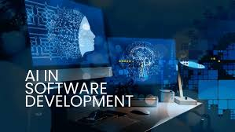

## I. Introduction

  Artificial intelligence has increasingly become an integral part of modern education, not as a replacement for learning, but as a tool that helps students formulate ideas, explore solutions, and draw inspiration. In my view, AI represents the next natural step in the advancement of educational technology rather than a threat to academic integrity or understanding. When used responsibly, AI does not diminish the learning experience; instead, it expands the resources available to both students and educators. In the context of software engineering, AI serves as a powerful assistant capable of generating small-scale code snippets and offering guidance, while still relying on human judgment for system design, architecture, and real-world problem solving. Throughout ICS 314, I used ChatGPT and Claude AI exclusively, leveraging each tool for different aspects of learning and development.

## II. Personal Experience with AI in ICS 314

 I made extensive use of AI during Experience WODs, Practice WODs, and In-class WODs, with the effectiveness of AI varying based on my ability to prompt it clearly and precisely. Early in the semester, I often began with a simple prompt such as “Here is a general instruction dump for the following coding assignment.” As the course progressed, I learned that adding more constraints significantly improved results. These included specifying ESLint restrictions, clarifying that VS Code was the development environment, and requesting comments only where necessary to explain functionality. For example, during one WOD I encountered a file pathing issue caused by misnamed files. While ChatGPT helped identify the general cause, I ultimately had to recognize and correct the specific naming inconsistencies myself, reinforcing the importance of human oversight.

   AI proved particularly useful for outlining tasks and creating a structured approach to meeting WOD requirements. However, as WODs increased in complexity and scope, I noticed that ChatGPT struggled to manage larger problem spaces effectively. At that point, a friend recommended Claude AI, which marked a significant improvement. Claude was able to handle entire WOD scopes with greater coherence, better maintain context, and align more closely with my intended design. Its ability to process uploaded images also made it especially convenient for debugging and understanding requirements. While fine-tuning was still necessary, Claude demonstrated a strong ability to understand overall vision and intent.

   For essay writing, both technical and non-technical, ChatGPT was particularly effective. Having used it previously as a writing assistant, it was already familiar with my writing “voice,” allowing me to transform brainstorm-style word dumps into polished drafts that only required light editing. In contrast, when learning new concepts or requesting simplified tutorials, ChatGPT was sufficient for breaking down ideas into more digestible explanations.
I did not use AI to generate or ask SMART questions, as I already have significant experience articulating technical issues clearly. However, I frequently used both Claude and ChatGPT for coding examples, writing code, documenting code, and explaining existing code, primarily within the context of ICS 314 WODs. AI was also valuable for quality assurance, such as identifying potential edge cases or flagging ESLint-related issues. Outside the specific course elements.

## III. Impact on Learning and Understanding

   The integration of AI into my learning process has made ICS 314 and other AI-permitted courses significantly more approachable. Having access to a tool capable of explaining concepts in a style aligned with my own way of thinking reduced frustration and accelerated comprehension. Rather than replacing understanding, AI often served as a catalyst that helped me bridge gaps in knowledge more efficiently.

## IV. Impact on Learning and Understanding

   AI has already reached a level where it can generate low-level or simple websites from minimal prompts, and I expect this capability to continue expanding. In the future, AI will not only assist developers in reducing development time but also empower non-technical users to create software-driven projects. However, AI remains fundamentally limited without human guidance. The presence of knowledgeable individuals is essential to ensure correctness, usability, and ethical application, particularly for real-world software engineering challenges.

## V. Challenges and Opportunities

   One of the most consistent challenges I encountered was AI’s difficulty in understanding large-scale, high-level ideas. AI tools often struggled with inferring correct context, sometimes fabricating incorrect assumptions or misinterpreting given information. This highlights an important opportunity within software engineering education: simply allowing AI use is not sufficient. Teaching students how to effectively use and guide AI tools could significantly improve outcomes and reduce misuse or frustration.

## VI. Comparative Analysis: AI vs. Traditional Teaching Methods

   Compared to traditional teaching methods, AI is an indispensable tool for software engineering education, particularly in improving comprehension and easing the cognitive load associated with complex concepts. However, overreliance on AI can reduce peer interaction and collaboration. In terms of practical skill development, AI is effective when solving familiar problems but often struggles when faced with novel or unconventional scenarios, making human problem-solving skills still essential.

## VII. Future Considerations

  I hope AI continues to be encouraged within software engineering education. When used appropriately, it removes many of the more mundane aspects of coding and learning, allowing students to focus on higher-level concepts, creativity, and solution design. Future integration should emphasize responsible usage and critical evaluation rather than passive dependence.

### VIII. Conclusion

  Overall, my experience with AI in ICS 314 has been overwhelmingly positive. Tools such as ChatGPT and Claude AI enhanced my ability to learn, experiment, and complete coursework more efficiently, while still requiring active engagement and critical thinking. AI did not replace the need for understanding or collaboration, but instead acted as a powerful assistant that complemented traditional learning methods. Moving forward, incorporating structured guidance on effective AI usage could further optimize its role in software engineering education, ensuring that students benefit from its strengths while remaining aware of its limitations.
