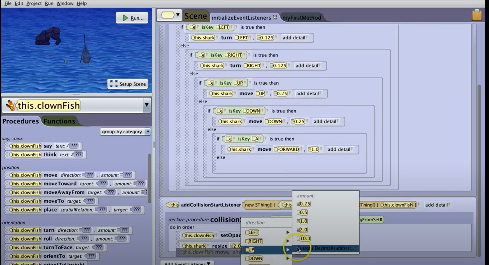

Alice is a free, educational programming environment designed to make learning coding concepts fun and accessible. It uses a drag-and-drop, block-based interface where users can create interactive 3D animations, stories, and simple games without needing to type complex code. Alice teaches fundamental programming concepts like loops, conditionals, and object-oriented design by letting users visually manipulate characters and scenes. It’s often used in classrooms to introduce beginners to programming in a more engaging, visual way before transitioning to text-based languages like Java or Python.

Using Alice, I had made a video game for my final project for my ICS 111 class. The requirements for the project required a certain minimum number of if statements, for/while loops, and plenty of other basic-level programming concepts, and pushed for creativity that implemented all the basics that we had learned over the course. I had made a video game called "Catch The Fish." The game makes great use of Alice's 3D environment and beginner-friendly level of programming by using "cameras" to manipulate perspectives and allow for the making of cinematic shots. The program alternates between cinematic scenes and user input, gameplay scenes. It starts with an introduction shot of 2 people in front of a submarine talking, via the use of Alice's text boxes, about catching fish underwater. Then it cuts to another shot of a bunch of differently sized sea creatures talking and then fleeing once they see a submarine approaching. This is where the gameplay actually starts, as you control the submarine "underwater" in a 3D space, and using Alice's simple object orientation tools, you can move the submarine around and chase the various fish trying to flee from you in a random, erratic fashion. The fish themselves are all different models that had to be animated to do various things while fleeing, such as doing flips, barrel rolls, speeding up, and slowing down. During gameplay, a random event can happen where a giant crab will spawn from beneath the sand and try to snap at objects. If the submarine touches the crab or the ground, you lose and have to start from the gameplay loop until you collide with one of the fish. Once you do catch one of the fish, it shows another cinematic that takes the specific model of fish that you collided with and displays it hanging over a fire. 

This final project helped me to learn the basics of programming through a visual, drag-and-drop environment, preparing me for text-based languages like Java. It taught me about program flow by showing how actions occur in sequence and over time, as well as methods for breaking programs into reusable parts. I had made use of variables to track information, conditionals to make decisions, and loops to repeat actions efficiently. The project also introduced event-driven programming, where user input triggers actions, and object-oriented thinking, since each object has its own properties and behaviors. By completing the project, I believe that I have gained a strong foundation in logic, problem-solving, and design, making the transition to more complex coding smoother and setting them up for success in future software or game development courses. 
