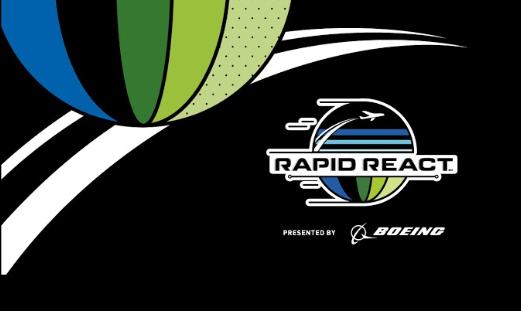
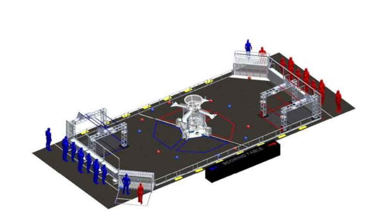
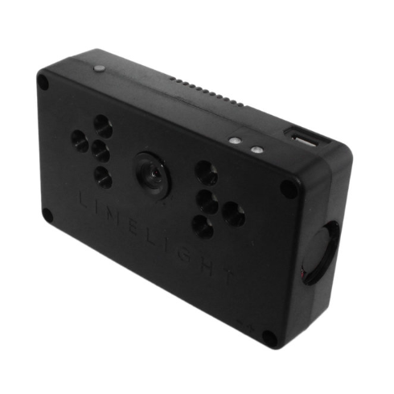

  
  
  

The FIRST Robotics Competition (FRC) is a worldwide high school robotics program where teams of students design, build, and program large robots to compete in themed games. Each January, the new game is revealed, and teams have about six weeks to create their robots with guidance from mentors, while staying within strict rules for size, weight, and budget. Events are structured like sports tournaments, with teams competing at local and regional levels to earn a spot at the FIRST Championship, a massive international event featuring teams from around the world. FRC emphasizes not just competition, but also values like Gracious Professionalism® and Coopertition®, encouraging teams to collaborate and help each other even while competing.

In 2022, the game was called RAPID REACT, presented by Boeing. Teams built robots to collect and shoot balls, called “cargo,” into either a lower or upper hub to score points. Matches began with an autonomous period, where robots operated using pre-programmed instructions, followed by a teleoperated(manual) period, where student drivers controlled the robots. The match ended with an exciting endgame challenge, where robots climbed a series of bars to earn extra points. After months of competition, top teams advanced to the FIRST Championship in Houston, where alliances of four teams battled for the world title in a thrilling finale.

I was co-lead programmer for Lahainaluna Robotics Club team 3882, which held variuos responsibilities such as teaching our new progammer team members, optimizing the works from senior team members that have graduated, and looking for entirely new ways to create better robots. During the 2022 Kickoff competition the team had worked on brainstorming and eventually designing the robot. My job as co-lead was the programming of the teleoperated section of the competition. This included the programming of the drive train, which I had the worked out with our lead programmer, the feed-load-shoot mechanism, limelight calibration, and the pnuematic system that was used for the "climbing" section of the competition. We had a tank based drive train which involved me programming an x-box controller to tell our robot to run only the left or right engines so that the robot can turn just like a real life tank. Our feed-load-shoot mechanism had used rubber rollers to scoop up balls into a chamber, which would then tell our limelight camera system to calculate the exact power needed to make a shot, before launching it out via spinning disks along the side of the chamber. All of which we had worked in close relation with the builders of our team, to make sure the right engines would get all the same power and that my limelight camera would accuratly calculate the correct power needed to make a shot. The limelight itself was an interesting piece of technology as it basically uses green lasers that reflect off of specilised tape that was lined across the targets to be able to calculate things like distance. Us programers and the build section had issues deciding wether we would use the limelight to auto drive us into a predetermined shooting distance/position or use it as an auto aim system that would shoot it out at the exact power needed. This conflict would eventually be solved by my input, when I brought up that it would be easier for the drivers of the robot if they only had to focus on the driving part and could let the shooter do all the work by itself no matter where they were. 

Once game season had kicked off our team was able to apply to 2 regional tournements, one in Orange County, CA and another in Honolulu, HI. During the competitions I was in charge of "On Demand" repairs and was the lead for any emergency repairs that needed to happen in case the robot got damadged or there was an issue with the limelight as a changing brightness of a room would interfere with the limelight calculating distance. The experience was extremley fun and there were a few moments where we didn't have an extxra part or a tool needed to repair our robot but other teams were amazing sports and would instantly offer their assistance not only in physical repair but also in code optimization. I learned a lot from what the other teams had done and it was interesting to see the various levels at which every team was at. The level difference between people only able to complete one part of the game compared to others which had been able to fully automate their robot without any visible issues had shown me how not only individuals, but teams can grow and become better. 

Here is a youtube link to one of our matches where we made it to the semi-finals in Honolulu as well as another link to an appreciation post made by the Lahainaluna School:
https://www.youtube.com/watch?v=wN6G2u-y3rQ
https://lahainalunahs.edlioschool.com/apps/news/article/1595614
