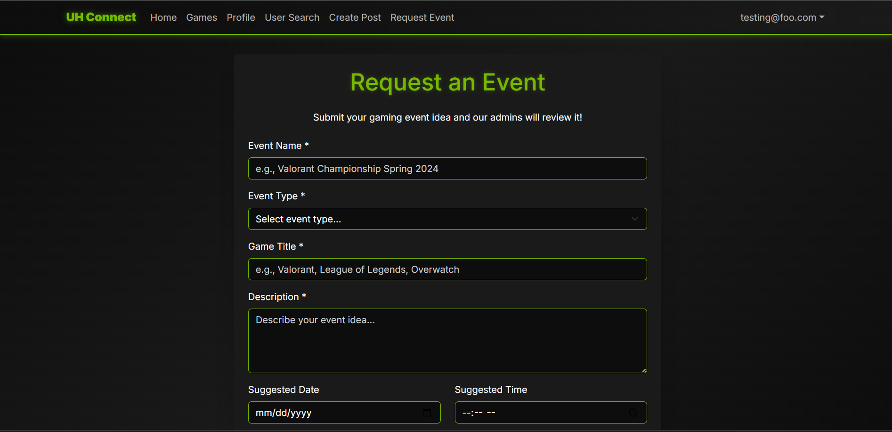
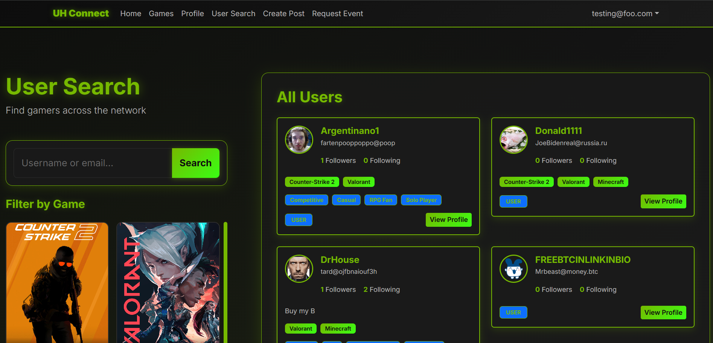

  
  
  

  UH Connect was a team-based software engineering project developed as part of ICS 314, focused on creating a centralized platform for University of Hawaiʻi students to discover, request, and manage campus events. The project emphasized full-stack web development, user experience design, and collaborative software engineering practices. Built using modern web technologies, UH Connect allowed users to search for events, request new events, and interact with administrators through a structured approval workflow. Beyond building a functional web application, the project served as a practical exercise in applying software engineering concepts such as modular design, coding standards, configuration management, and agile development.

  My primary contributions were centered around frontend development, UI/UX design, and feature implementation across multiple parts of the application. I implemented the landing page (Issue #1), ensuring a clear and visually engaging entry point for users, and later redesigned the overall visual theme of the site (Issue #17) by applying a consistent NVIDIA-inspired dark gray, black, and green color palette. This aesthetic direction became the foundation for all subsequent pages as new features were added. I also developed the user search page that pulls data directly from the database (Issue #16), implemented logic to redirect logged-in users to the home page instead of the login screen (Issue #18), and fixed a critical bug preventing users from changing their passwords (Issue #40). One of my larger contributions was designing and implementing the “Request Event” page (Issue #30), which allows users to submit event requests that are written to the database. I later extended this functionality by implementing the admin-facing event request dashboard (Issue #41), which enabled administrators to view, filter, and manage event requests across multiple states (unopened, pending, live, and closed).

  Through this project, I significantly strengthened my skills in TypeScript, SQL, Vercel and full-stack development, as well as my ability to work within a team using Git and GitHub. Coordinating features across multiple contributors required clear communication, careful branching, and frequent debugging of merge conflicts and shared components. One of the most challenging aspects was managing UI consistency and layout behavior across pages with different requirements, which reinforced the importance of thoughtful component design and incremental testing. Overall, this project deepened my understanding of collaborative software development, reinforced the value of clean UI design paired with strong coding standards, and gave me practical experience building a real-world application from concept to implementation.

## Further Information

- **Live Application:** [uh-connect.vercel.app](https://uh-connect.vercel.app)
- **GitHub Repository:** [Project-UHConnect](https://github.com/gamer-connects/Project-UHConnect.git)
- **Project Page:** [Portfolio Write-up](https://github.com/gamer-connects/gamer-connects.github.io.git)

